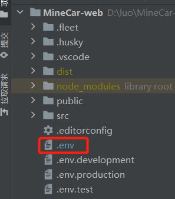

# MineCar-web

### 介绍 📖

MineCar-web 基于 Vue3.2、TypeScript、Vite3、Pinia、Element-Plus 的环形矿场矿车目标检测系统前端，使用目前最新技术栈开发。基于开源项目 Geeker-Admin 开发

### 开源代码仓库 ⭐

- GitHub：https://github.com/HalseySpicy/Geeker-Admin

### 开源项目文档 📚

- 项目更新日志：[CHANGELOG.md](./CHANGELOG.md)

- 项目文档地址（持续更新中）：https://docs.spicyboy.cn

### 项目功能 🔨

- ​

### 安装使用步骤 📔

- **Clone：**

```text
# Gitee
git clone https://gitee.com/laramie/Geeker-Admin.git
# GitHub
git clone https://github.com/HalseySpicy/Geeker-Admin.git
```

- **Install：**

```text
npm install

# npm install 安装失败，请升级 nodejs 到 16 以上，或尝试使用以下命令：
npm install --registry=https://registry.npm.taobao.org
```

- **Change：**



```text
修改 .env 中的配置
# 本地部署
VITE_USE_ADDRESS = "http://localhost:8000"
VITE_UPLOAD_ADDRESS = "http://localhost:8000/image"
VITE_Detection = "ws://127.0.0.1:8000/ws/video/"

# 线上部署
# VITE_USE_ADDRESS = "http://120.26.1.222:8000"
# VITE_UPLOAD_ADDRESS = "http://120.26.1.222:8000/image"
# VITE_Detection = "ws://http://120.26.1.222:8000/ws/video/"

取消对应注释即可
```

- **Run：**

```text
npm run dev
npm run serve
```

- **Build：**

```text
# 开发环境
npm run build:dev

# 测试环境
npm run build:test

# 生产环境
npm run build:pro
```

- **Lint：**

```text
# eslint 检测代码
npm run lint:eslint

# prettier 格式化代码
npm run lint:prettier

# stylelint 格式化样式
npm run lint:stylelint
```

- **commit：**

```text
# 提交代码（提交前会自动执行 lint:lint-staged 命令）
npm run commit
```

### 文件资源目录 📚

```text
Geeker-Admin
├─ .husky                 # husky 配置文件
├─ .vscode                # VSCode 推荐配置
├─ public                 # 静态资源文件（该文件夹不会被打包）
├─ src
│  ├─ api                 # API 接口管理
│  ├─ assets              # 静态资源文件
│  ├─ components          # 全局组件
│  ├─ config              # 全局配置项
│  ├─ directives          # 全局指令文件
│  ├─ enums               # 项目常用枚举
│  ├─ hooks               # 常用 Hooks 封装
│  ├─ languages           # 语言国际化 i18n
│  ├─ layouts             # 框架布局模块
│  ├─ routers             # 路由管理
│  ├─ stores              # pinia store
│  ├─ styles              # 全局样式文件
│  ├─ typings             # 全局 ts 声明
│  ├─ utils               # 常用工具库
│  ├─ views               # 项目所有页面
│  ├─ App.vue             # 项目主组件
│  ├─ env.d.ts            # 指定 ts 识别 vue
│  └─ main.ts             # 项目入口文件
├─ .editorconfig          # 统一不同编辑器的编码风格
├─ .env                   # vite 常用配置
├─ .env.development       # 开发环境配置
├─ .env.production        # 生产环境配置
├─ .env.test              # 测试环境配置
├─ .eslintignore          # 忽略 Eslint 校验
├─ .eslintrc.js           # Eslint 校验配置文件
├─ .gitignore             # 忽略 git 提交
├─ .prettierignore        # 忽略 Prettier 格式化
├─ .prettierrc.js         # Prettier 格式化配置
├─ .stylelintignore       # 忽略 stylelint 格式化
├─ .stylelintrc.js        # stylelint 样式格式化配置
├─ CHANGELOG.md           # 项目更新日志
├─ commitlint.config.js   # git 提交规范配置
├─ index.html             # 入口 html
├─ LICENSE                # 开源协议文件
├─ lint-staged.config     # lint-staged 配置文件
├─ package-lock.json      # 依赖包包版本锁
├─ package.json           # 依赖包管理
├─ postcss.config.js      # postcss 配置
├─ README.md              # README 介绍
├─ STANDARD.md            # 项目编码规范说明书
├─ tsconfig.json          # typescript 全局配置
└─ vite.config.ts         # vite 全局配置文件
```

### 浏览器支持 🌎

- 本地开发推荐使用 Chrome 最新版浏览器 [Download](https://www.google.com/intl/zh-CN/chrome/)。
- 生产环境支持现代浏览器，不在支持 IE 浏览器，更多浏览器可以查看 [Can I Use Es Module](https://caniuse.com/?search=ESModule)。

|  |  |  |  |  |
| :-------------------------------------------------------------------------------------------------------------------------------------: | :-------------------------------------------------------------------------------------------: | :----------------------------------------------------------------------------------------------------: | :-------------------------------------------------------------------------------------------------: | :-------------------------------------------------------------------------------------------------: |
|                                                               not support                                                               |                                        last 2 versions                                        |                                            last 2 versions                                             |                                           last 2 versions                                           |                                           last 2 versions                                           |

### 项目后台接口 🧩
